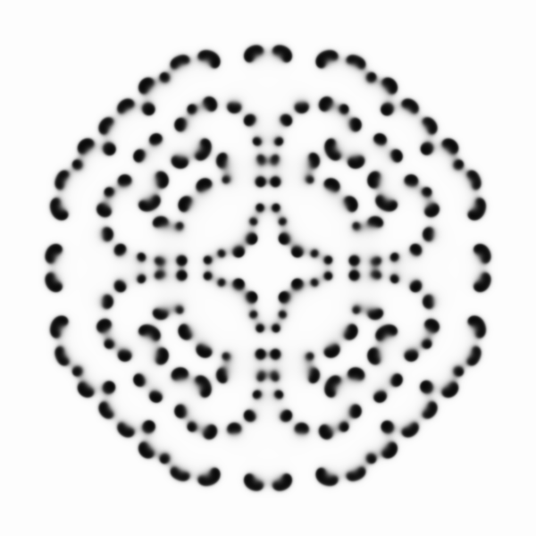
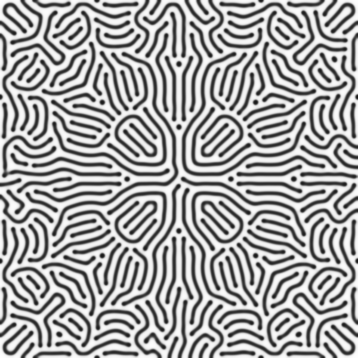

# Reaction-Diffusion-Generative-Art
This project explores generative art through reaction-diffusion systems, implemented with Processing (Java) and GLSL shaders inspired by the Gray-Scott model.

## Overview
Reaction-diffusion systems simulate natural patterns such as animal skin textures or chemical waves. This project combines algorithmic aesthetics and visual diversity by adjusting initial conditions and parameters to generate dynamic visuals.

## Examples
Here are some example images generated by the system:




## Installation
1. Install [Processing](https://processing.org/download/)
2. Clone this repository:
   ```bash
   git clone https://github.com/Mengpuu/Reaction-Diffusion-Generative-Art.git
   ```
3. Install the [PixelFlow](https://github.com/diwi/PixelFlow) library, which is used to integrate Shadertoy GLSL code into Processing.
4. Open the `rd.pde` file in Processing
5. Run the sketch

## Usage
- Adjust simulation parameters in the code
- Press `s` to save images during the simulation
- Experiment with different initial patterns

## Shadertoy Implementation
The GLSL shader code is included under `shaders/`. It can be directly tested on [Shadertoy](https://www.shadertoy.com/) or integrated into Processing with the PShader class.

The Shadertoy code used in this project is based on the example available at: [Shadertoy - XslyD2](https://www.shadertoy.com/view/XslyD2)

## License
This project is licensed under the MIT License.

## Acknowledgements
- Inspired by [Shadertoy](https://www.shadertoy.com/) community examples
- Gray-Scott model reference: Pearson, J. E. (1993). "Complex patterns in a simple system"
